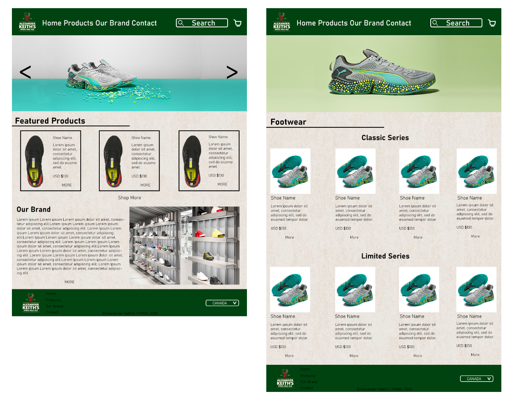

# Project 3: Midterm Prep

This git repo includes the wireframes, mockups, doc outline and html pages for the first two pages of the integrated midterm.

### Getting Started
This is a basic HTML / CSS build.

To view the pages, clone this to the location of your choice, and open the ".html" file.

You can also view the source code by opening it in any code editing program of your choice, or clicking inspect in a chrome tab.

### Prerequisites
All you need to run these pages is an up to date browser.

## Authors
1. Greg Avery - Front End Dev & Designer
